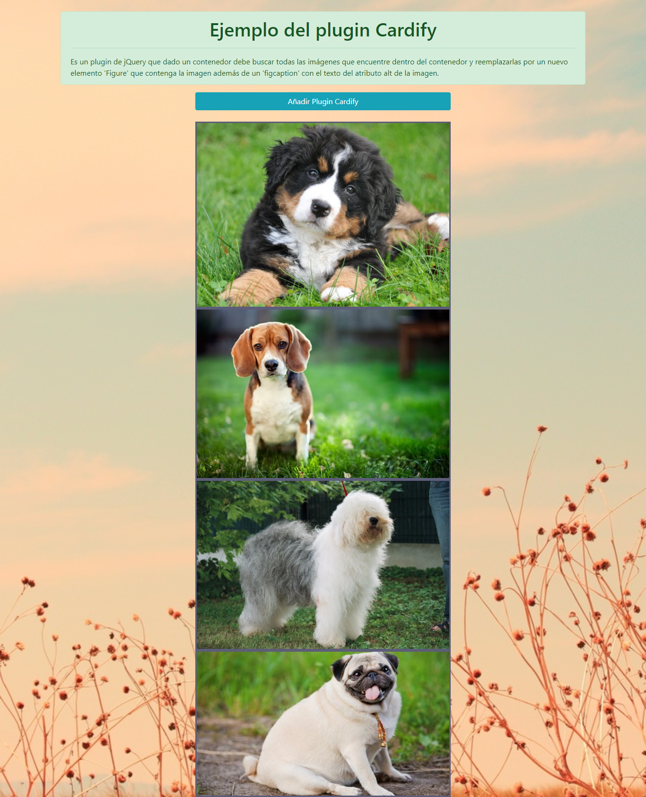
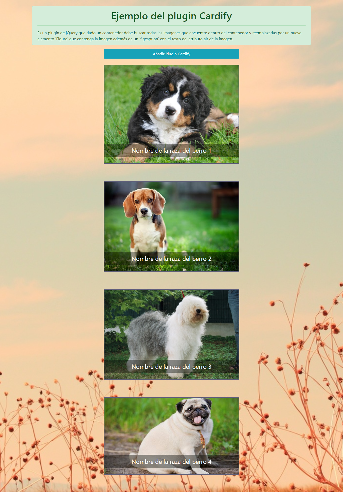

# Plugin Cardify

## ¿De qué trata?

Es un plugin de jQuery que dado un _contenedor_ debe buscar todas las
imágenes que encuentre dentro del _contenedor_ y reemplazarlas por un nuevo
elemento `<figure>` que contenga la imagen (``) además de un `<figcaption>`
con el texto del atributo `alt` de la imagen.

***

## Flujo de trabajo

### SEMANA 1

* Formar equipo.
* Elegir reto.
* Hacer fork de reto modelo o crear nuevo repo si has propuesto un reto no propuesto por Laboratoria.
* Escribir primera versión del README.md con una descripción general de la librería así como ejemplos (snippets) de uso y configuración (si fuera necesario).
* Crear issues y milestones que sirvan como hoja de ruta (roadmap)
* Inicializar proyecto con npm init y git init.
* Crear index.html con ejemplo principal de uso.

### SEMANA 2

Agregar tests que describan la API de tu librería y los casos de uso esperados.
Implementar funcionalidad esencial.
Hacer code review con tus compañeras e instructorxs.

### SEMANA 3

* Completar implementación de librería y ejemplo principal (usando la librería).
* Hacer code review con tus compañeras e instructorxs.
* Preparar tu demo/presentación.
* Publicar el ejemplo principal (index.html) en GitHub pages.

***
## Archivos incluidos:

* _README.md_ con descripción del módulo, instrucciones de instalación, uso y documentación del API.

* _index.js_: Librería debe exportar una función u objeto al entorno global (window) y hacer uso de features de ES6 donde sea apropiado.

* _index.html_: Página web de la librería con ejemplo funcionando.

* _package.json_ con nombre, versión, descripción, autores, licencia, dependencias, scripts (pretest, test, ...)

* _.eslintrc_ con configuración para linter (ver guía de estilo de JavaScript)

* _.gitignore_ para ignorar node_modules u otras carpetas que no deban incluirse en control de versiones (git).

***

## Instalación

### Global (navegador)

```html
<link rel="stylesheet" href="css/jquery.cardify.css">
<script src="https://ajax.googleapis.com/ajax/libs/jquery/3.2.1/jquery.min.js"></script>
<script src="js/jquery.cardify.js"></script>
```

## Uso

```js
// `container` es el selector del contenedor donde se buscarán todas las
// imágenes a ser procesadas.
$(document).ready(function() {
  $('#addPlugin').one('click', function() {
    $('#container').cardify();
  });
});
```

*** 

## Ejemplo del plugin

#### A) Se visualiza las imagenes sin titulo 



#### B) Por medio del botón activamos el plugin, de la cual se visualiza cada imagen con su respectivo título.


