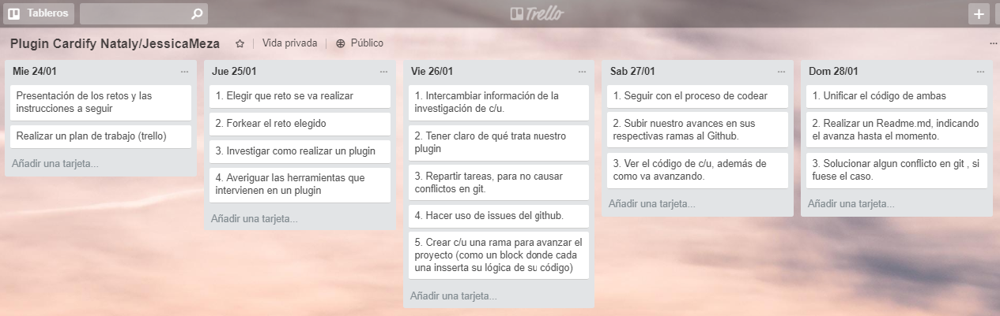
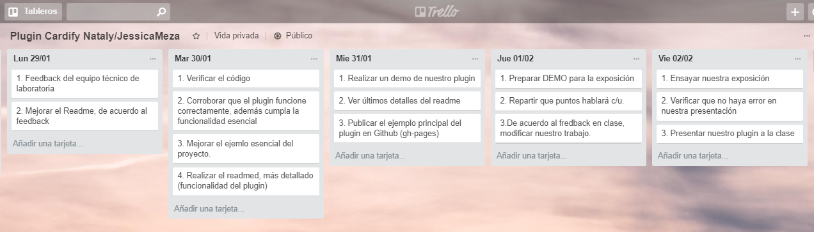

# Cardify

### Reto-Laboratoria

Realizar un plugin que permita mostrar el atributo `alt` en ves de la imagen (`img`) en hover.
* Duración: 10 días

## Integrantes
* Nataly Otero Celis.
* Jessica Meza Rojas.

## Introducción
El contenido de este `Readme.md`, está destinado a presentar de una forma sencilla la planificación, el desarrollo y resultado de nuestro plugin _Cardify_. Es decir dejar listo para que otros desarrolladores puedan seguir construyendo sus propias extensiones a partir de nuestro código.

## Objetivos

* Lograr la funcionalidad de mostrar el atributo `alt` en ves de la imagen (`img`) en hover.

* Realizar un _DEMO_, con un ejemplo principal de uso.


## Etapa de planificación

Para está etapa, usamos la herramienta _trello_, facilitando la organización de tareas.




## Desarrollo

### 1. Herramientas:

* _HTML5_
* _CSS3_
* _jQuery_, versión 3
* Bootstrap 4.0
* La sintaxis de nuestro código está en ECMAScript 6 (ES-6), sin embargo no todos los navegadores permite leerlo, por ello utilizamos _BABEL_, para transformar la sintaxis del código de ES-6 a ES-5.

### 2. Estructura de nuestros archivos: 


 Cardigy es un plugin de Jquery liviano que te permite implementar un efecto _hover_ a tus imágenes 

Cardify es un Plugin de Jquery liviano que te permite implementar un efecto hover a tus imágenes con estilo. Es fácil de usar con un diseño sencillo y se ajustará a tus necesidades, esto lo pueden usar desarrolladores y diseñadores.


Cardify es un Plugin de Jquery liviano que te permite buscar todos tus elementos `img` que se encuentro en un contenedor específico y crear el elemento `figure` para cada uno de tus imagenes, además de añadir un `figcaption` con el texto del atributo alt de tu imagen.
## Integrantes

* Nataly Otero Celis.
*  Jessica Meza

## Herramientas

* Jquery.
* Bootstrap 4.0
* HTML5.
* CSS3.


## Instalación
1. Cargue la última biblioteca de jQuery (se recomienda una versión delgada) y el plugins jquery.cardify.js con su respectivo archivo css en el documento html.
2. Simplemente llame a la función principal del plugins en el elemento de destino y listo.

### Global (navegador)

```html
<link rel="stylesheet" href="css/jquery.cardify.css">
<script src="https://ajax.googleapis.com/ajax/libs/jquery/3.2.1/jquery.min.js"></script>
<script src="js/jquery.cardify.js"></script>
```

## Uso

```js
// `container` es el selector del contenedor donde se buscarán todas las
// imágenes a ser procesadas.
    $('#container').cardify();
```
## Ejemplo

+ html
```html
 <div class="container-img">
    
    
 </div>
```

+ js
```js
$(document).ready(function() {
  $('#btn-plugins').on('click',function() {
    $('container-img').cardify();
  });  
});
```
***
***

### Planificacion

Semana 1 - Semana 3
24 Enero
- Formación de Equipo.
- Investigación sobre los casos para la elección del Reto.

26 Enero
- Hacer fork de reto propuesto, el reto elegido fue el 2 <Cardify>.
- Se coordino realizar versión para plugins.

28 Enero
- Creación de issues.
- Inicializando proyecto e implementando requisitos.
- Creación de versiones del plugins.

29 Enero
- Se subió a la rama master la implementación del Reto.

*** 
## Demo

#### A) Se visualiza las imágenes sin título.


#### B) Por medio del botón activamos el plugin, de la cual se visualiza cada imagen con su respectivo título al pasar el mouse por la imagen.


